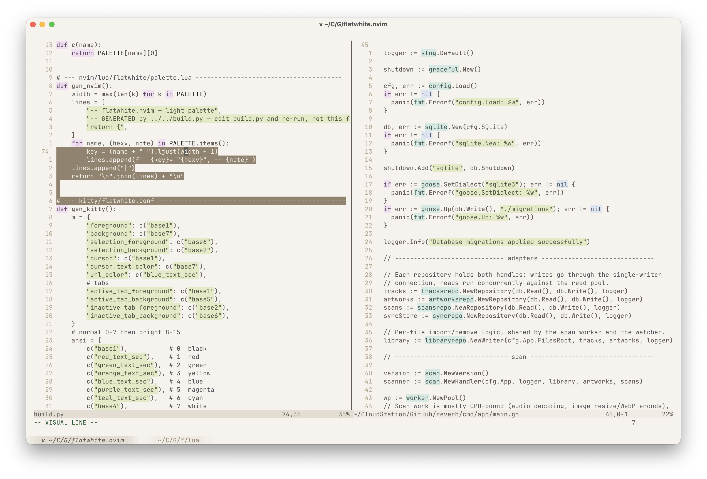
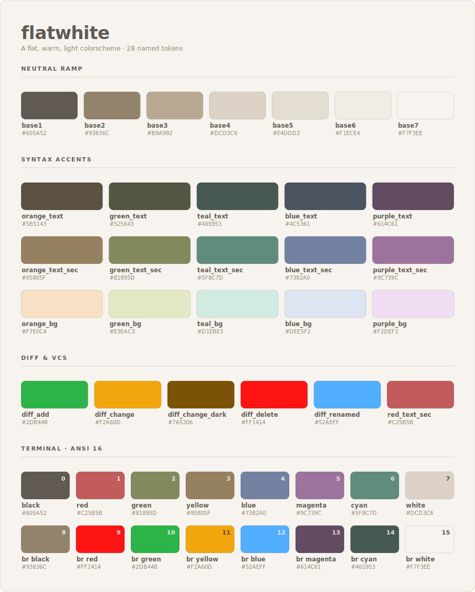

# flatwhite

A flat, warm, light colorscheme — a soft off-white background with muted,
low-contrast syntax colors — packaged for multiple apps in one repo.

Ported and slightly modified from the [Helix editor's `flatwhite`
theme](https://github.com/helix-editor/helix/blob/master/runtime/themes/flatwhite.toml),
which is itself adopted from the original
[flatwhite-syntax](https://github.com/biletskyy/flatwhite-syntax) Atom theme.



Supported apps:

| App    | Theme file                       | Format          |
| ------ | -------------------------------- | --------------- |
| Neovim | repo root (`colors/`, `lua/`)    | Lua (no deps)   |
| bat    | `bat/flatwhite.tmTheme`          | Sublime tmTheme |
| kitty  | `kitty/flatwhite.conf`           | kitty conf      |
| fish   | `fish/flatwhite.fish`            | fish script     |

The repo root is itself a standard Neovim plugin, so lazy.nvim / packer install
it with the plain `"user/repo"` shorthand. The `bat/` and `kitty/` folders sit
alongside as extras.

## Palette



All 28 tokens: a seven-step warm neutral ramp, five syntax accent families
(each with `text` / `text_sec` / `bg`), the diff colors, and the derived
ANSI 16 terminal set. This image is generated by `build.py`, so it never
drifts from the actual theme.

## Single source of truth

All colors live in **`build.py`**. It is the one place to edit the palette;
running it regenerates every app's theme file so they never drift:

```sh
python3 build.py
```

This regenerates:

- `lua/flatwhite/palette.lua`
- `kitty/flatwhite.conf`
- `fish/flatwhite.fish`
- `bat/flatwhite.tmTheme`
- `assets/palette.svg`

Neovim's highlight *logic* (`lua/flatwhite/init.lua`) is hand-written and
not generated — it just references the palette keys. Everything else is
generated; the "GENERATED by build.py" header marks those files. Python is only
needed to regenerate; end users install the committed files directly.

## Install

### Neovim

The repo root is a standard plugin, so installation is the normal shorthand.

**lazy.nvim**:

```lua
{
  "postrockreverb/flatwhite.nvim",
  lazy = false,      -- load during startup
  priority = 1000,   -- load colorschemes before other plugins
  config = function()
    vim.o.termguicolors = true
    vim.cmd.colorscheme("flatwhite")
  end,
}
```

### bat

```sh
mkdir -p "$(bat --config-dir)/themes"
cp bat/flatwhite.tmTheme "$(bat --config-dir)/themes/"
bat cache --build
bat --theme=flatwhite file.lua
```

Make it the default in `$(bat --config-dir)/config`:

```
--theme="flatwhite"
```

### kitty

Copy the theme next to your kitty config and include it:

```sh
cp kitty/flatwhite.conf ~/.config/kitty/flatwhite.conf
```

In `~/.config/kitty/kitty.conf`:

```
include flatwhite.conf
```

Then reload with `ctrl+shift+F5` (or restart kitty).

### fish

fish highlights the command line with its own `fish_color_*` variables, which
override the terminal palette — so kitty's theme alone won't touch what you
type. Drop the theme into `conf.d`, where fish loads it automatically:

```sh
cp fish/flatwhite.fish ~/.config/fish/conf.d/flatwhite.fish
exec fish   # reload
```

It uses `set -g`, so it shadows any universal colors a previous `fish_config`
theme left behind — no need to clear them first.

## Structure

```
.
├── build.py                   # source of truth + generator
├── colors/flatwhite.lua       # :colorscheme flatwhite entry point
├── lua/flatwhite/
│   ├── init.lua               # highlight groups + setup() (hand-written)
│   └── palette.lua            # GENERATED
├── bat/
│   └── flatwhite.tmTheme      # GENERATED
├── kitty/
│   └── flatwhite.conf         # GENERATED
├── fish/
│   └── flatwhite.fish         # GENERATED
└── assets/
    ├── screenshot.png
    └── palette.svg            # GENERATED
```

## Tweaking colors

1. Edit the `PALETTE` dict (or the kitty ANSI / bat scope maps) in `build.py`.
2. Run `python3 build.py`.
3. For Neovim, also adjust `lua/flatwhite/init.lua` if you're adding or
   changing which highlight groups use which palette keys.

## Credits & license

This theme stands on prior work:

- **Original palette** — [flatwhite-syntax](https://github.com/biletskyy/flatwhite-syntax)
  by biletskyy, licensed **MIT** (© 2016).
- **Direct source** — the [`flatwhite` theme in Helix](https://github.com/helix-editor/helix/blob/master/runtime/themes/flatwhite.toml)
  by Alexander Brevig and krfl. The Helix project is licensed **MPL-2.0**.

The colors here were ported from the Helix theme and lightly modified; the
Neovim highlight logic, generator, and packaging are original to this repo.
See [`NOTICE`](NOTICE) for upstream attributions and [`LICENSE`](LICENSE) for
this repo's terms.
